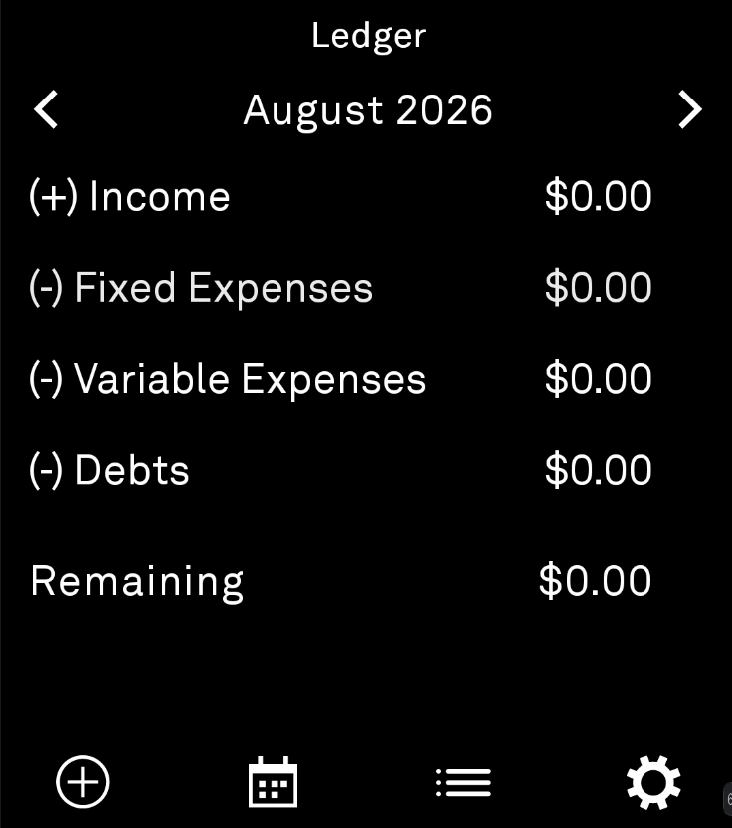
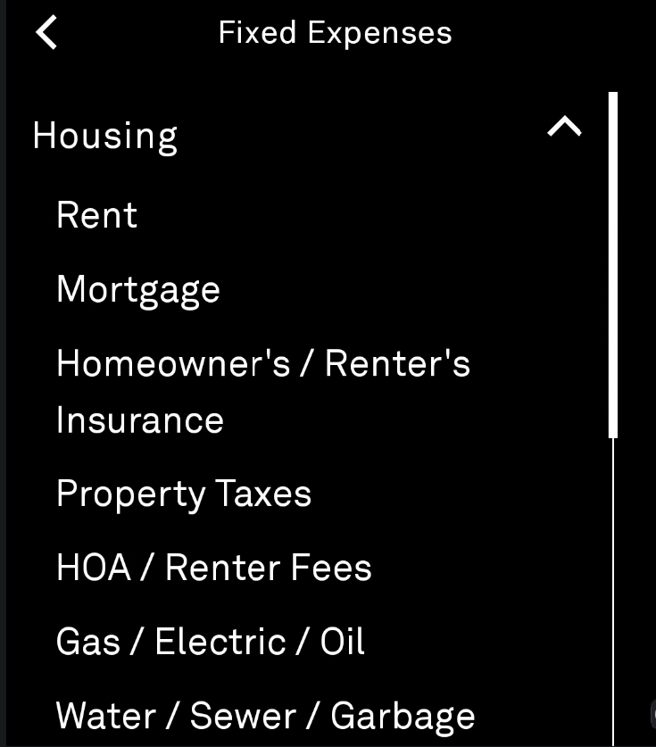
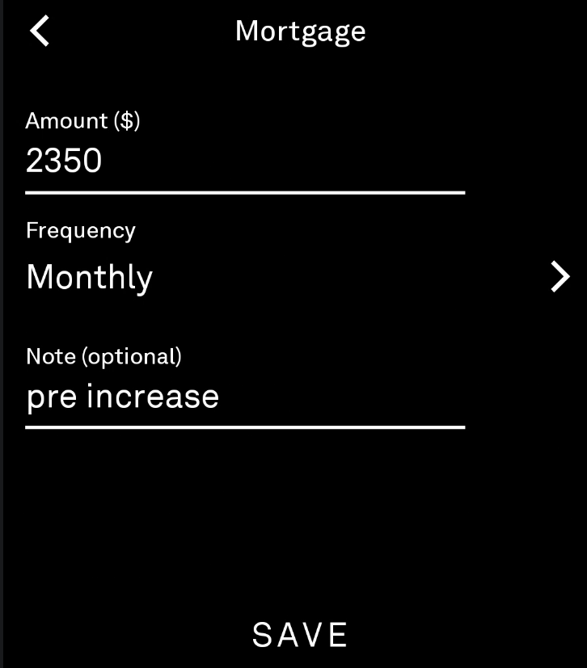
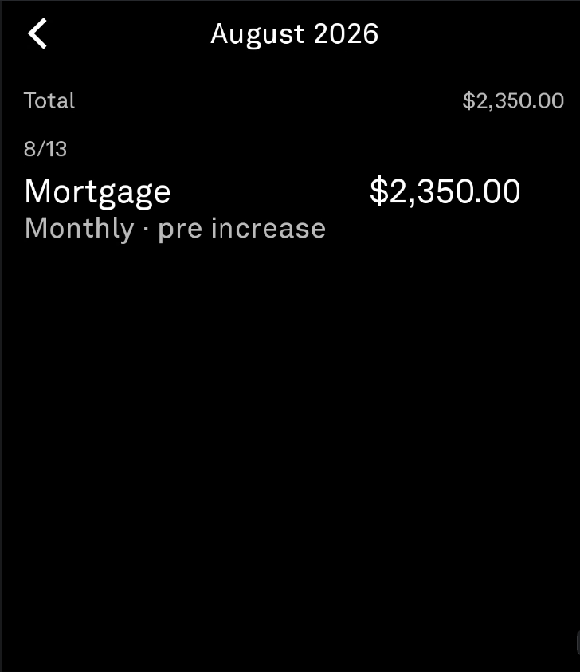
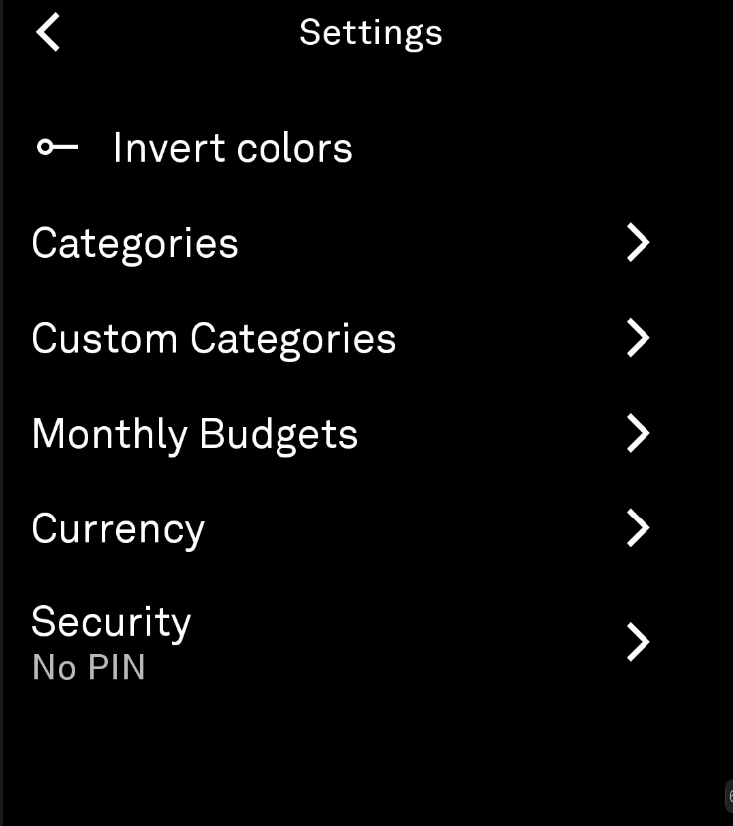

# Ledger

A minimalist budget planner and expense tracker for the Light Phone III. Set monthly targets by category, log income and expenses, and see spent vs. budgeted at a glance.

## Features

**Budget Planning**
- Set monthly budget targets per category group (Housing, Food, Transportation, etc.)
- Budget amounts carry over month-to-month automatically
- Progress bars on the home screen show spent vs. budgeted

**Expense Tracking**
- Log income, fixed expenses, variable expenses, and debts
- Frequency tags: One-time, Weekly, Biweekly, Bimonthly, Monthly, Quarterly, Annually
- Add optional notes to any entry
- Navigate to any month to backtrack entries

**Categories**
- 12 category groups with 50+ default subcategories based on standard household budgeting
- Savings & Investments group (Savings for a Goal, Emergency Savings, 401k/403B, IRA, Stocks)
- Add, rename, or delete custom categories
- Hide/show default categories to match your needs

**Currency**
- 60+ currencies across 7 regions (Americas, Europe, Asia-Pacific, Africa, Middle East)
- Collapsible region picker

**Security**
- Optional 4-digit PIN lock
- Locks automatically when the app is backgrounded from any screen

## Screenshots

<p align="center">
  
  
  
</p>
<p align="center">
  
  
</p>

## Installation

### From Releases

Download the latest `.apk` from [Releases](https://github.com/tyshi00/Ledger/releases), or add this repo to [Obtainium](https://obtainium.imranr.dev/) for automatic updates. Install over ADB:

```
adb install ledger-vX.Y.Z-release.apk
```

### From Source

1. Clone this repository.
2. Add your GitHub token for the Light SDK packages. The token needs the `read:packages` scope. Generate one at [GitHub Settings > Tokens](https://github.com/settings/tokens/new).
   ```
   echo "gpr.user=YOUR_GITHUB_USERNAME" >> local.properties
   echo "gpr.key=YOUR_GITHUB_TOKEN" >> local.properties
   ```
3. Build:
   ```
   ./gradlew :tool:assembleDebug
   ```
4. Install:
   ```
   adb install -r tool/build/outputs/apk/debug/tool-debug.apk
   ```

## Known Issues

- **PIN screen flash:** When returning to the app after backgrounding, the underlying screen may flash for one frame before the PIN pad appears. Android restores the saved visual state before any app code runs. The proper fix (`FLAG_SECURE` on the Activity window) requires APIs the Light SDK restricts.

## Credits

Built on the [Light SDK](https://github.com/lightphone/light-sdk) by The Light Phone (MIT). The original copyright notice is kept in [LICENSE](LICENSE), and the SDK's own README is kept in [README.light-sdk.md](README.light-sdk.md).

PIN lock pattern inspired by [Molly](https://github.com/jabberbox/molly-light) (Signal fork for Light Phone).

Icon design included.

## License

MIT. See [LICENSE](LICENSE).

## Disclaimer

Unofficial, independent open-source project — not affiliated with or endorsed by The Light Phone, Inc. Light Phone and Light OS are trademarks of The Light Phone, Inc.
